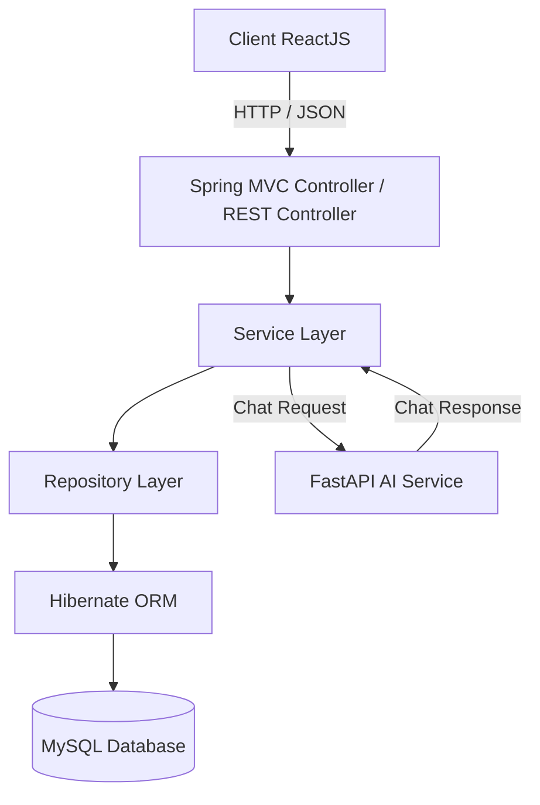
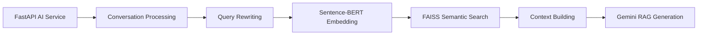

# Digital Library

Digital Library is a digital library system that supports users in searching for documents, viewing document details, borrowing/accessing documents, reviewing documents, bookmarking favorite documents, and managing documents based on user roles. The project consists of two main parts:

- **Backend**: Java Spring MVC/Spring Security/Hibernate, used to implement REST APIs and the admin management pages with Thymeleaf.
- **Frontend**: ReactJS, used to build the user interface for roles such as student, lecturer, and librarian.

> Note: the **admin** module in this project is handled by **Thymeleaf in the backend**, not by ReactJS.

---

## 1. Project Objectives

This project is built to simulate a digital library system with the following main features:

- User registration, login, and authentication using JWT.
- Profile management and password change.
- Viewing document lists with search, filter, sort, and pagination.
- Viewing document details, document files, views, downloads, and ratings.
- Bookmarking favorite documents.
- Reviewing/rating documents.
- Borrowing or accessing document content.
- Librarians can create, update, soft-delete, and upload documents.
- Admins can approve librarians, approve documents, and manage users/categories/documents.
- System overview statistics.
- AI Chatbot for conversational document discovery using Semantic Search and Retrieval-Augmented Generation (RAG).**

---

## 2. Overall Architecture

The project follows a multi-layer architecture:



The project also includes a separate AI Service for the AI Chatbot:



The Spring Backend acts as the integration layer between the ReactJS frontend and the AI Service.

### Layer Responsibilities

| Layer | Responsibility |
|---|---|
| Controller | Receives requests from clients, gets `@RequestParam`, `@PathVariable`, `@RequestBody`, calls the service layer, and returns responses. |
| Service | Handles the main business logic, security checks, permission checks, and data validation. |
| Repository | Queries the database using Hibernate/HQL/Criteria. |
| DTO | Wraps data returned to the frontend, avoids exposing entities directly, and prevents leaking sensitive data. |
| Entity/POJO | Represents database tables. |
| Config | Configures Spring MVC, Hibernate, Security, CORS, Thymeleaf, and file upload. |
| AI Service | Processes chatbot requests, performs Semantic Search, builds retrieved context, and generates RAG responses. |

---

## 3. Technologies Used

### 3.1. Backend

| Technology | Usage in the project |
|---|---|
| Java | Backend programming language. |
| Spring Framework / Spring MVC | Builds the web application using the MVC model and handles request/response flows. |
| Spring Security | Handles authentication, authorization, and API protection by role. |
| JWT | Authenticates secured APIs under `/api/secure/**`. |
| Hibernate ORM | Maps Java entities to MySQL tables and queries data. |
| MySQL | Relational database management system. |
| Maven | Manages dependencies and builds the project. |
| Apache Tomcat | Runs the Java Web application as a WAR deployment. |
| Thymeleaf | Builds the backend admin interface. |
| Jackson | Converts Java objects to JSON and JSON to Java objects. |
| Cloudinary | Stores images such as avatars and thumbnails. |
| Postman | Tests backend APIs. |

### 3.2. Frontend

| Technology | Usage in the project |
|---|---|
| ReactJS | Builds the user interface. |
| Yarn | Manages frontend libraries. |
| React Router DOM | Handles navigation between frontend pages. |
| Axios | Calls REST APIs from the backend. |
| Bootstrap / React Bootstrap | Builds responsive UI quickly. |
| React Bootstrap Icons | Displays icons such as up/down arrows, bookmark icons, user icons, and document icons. |
| Context API / Local Storage / Cookie | Stores login state, token, or user information if used by the project. |

### 3.3. AI Service

The AI Chatbot is implemented as a separate Python service and communicates with the Spring Backend.

| Technology | Usage in the project |
|---|---|
| Python | Programming language for the AI Service. |
| FastAPI | Provides the HTTP API for chatbot requests. |
| Sentence-BERT | Generates vector embeddings for semantic document retrieval. |
| FAISS | Performs vector similarity search over the document embedding index. |
| Gemini | Generates conversational responses using retrieved library context. |
| RAG | Grounds generated answers in retrieved library documents. |

---

## 4. Features by Role

### 4.1. Guest

Unauthenticated users can:

- View public document lists.
- Search for documents.
- Filter documents by category.
- View details of approved documents.
- View public reviews of documents.
- Register an account.
- Log in.
- **Use the AI Chatbot to discover documents through natural-language queries.**

### 4.2. Student / Lecturer

After logging in, users can:

- View their personal profile.
- Update personal information.
- Change password.
- Bookmark documents.
- View their bookmark list.
- Review/rate documents.
- Borrow or access documents.
- View their borrowing history.
- Access document content if they satisfy the access conditions.
- **Use the AI Chatbot for conversational document discovery and follow-up questions.**

### 4.3. Librarian

Librarians can:

- Manage documents uploaded by themselves.
- Create new documents.
- Upload thumbnails and document files.
- Update document metadata.
- Soft-delete documents.
- View users who borrowed/accessed their documents.

> Note: librarians must be approved by an admin before they can create, update, or delete documents.

### 4.4. Admin

Admins manage the system through the Thymeleaf interface in the backend:

- Log in to the admin page.
- View the dashboard.
- Manage users.
- Lock/unlock user accounts.
- Approve or reject librarians.
- Manage categories.
- Approve or reject documents.
- View overview statistics, access statistics, and borrowing statistics.

---

## 5. Suggested Folder Structure

The actual structure may differ slightly depending on the branch, but the project should be organized similarly:

```text
DigitalLibrary/
├── pom.xml
├── src/
│   ├── main/
│   │   ├── java/
│   │   │   └── com/trangnhk/
│   │   │       ├── configs/          # Spring MVC, Security, Hibernate, CORS configuration
│   │   │       ├── controllers/      # REST API controllers and Thymeleaf controllers
│   │   │       ├── dto/              # Request/response DTOs
│   │   │       ├── filters/          # JWT filter if available
│   │   │       ├── pojo/             # Database entity mappings
│   │   │       ├── repositories/     # Database query layer
│   │   │       ├── services/         # Business logic layer
│   │   │       ├── client/            # External service clients, including AI Service client
│   │   │       └── utils/             # JWTUtils, file upload helpers, etc.
│   │   ├── resources/
│   │   │   ├── database.properties   # Database configuration
│   │   │   ├── templates/            # Thymeleaf admin files
│   │   │   └── static/               # CSS, JS, images for admin if available
│   │   └── webapp/
│   └── test/
└── target/

AI-Service/
├── app/
│   ├── apis/                          # FastAPI routers and schemas
│   ├── config/                        # AI Service configuration
│   ├── model/                         # Conversation/domain models
│   ├── prompt/                        # RAG prompt definitions
│   ├── services/                      # Chatbot, retrieval, embedding, FAISS, etc.
│   └── main.py                        # FastAPI entry point
├── data/
│   ├── index/                         # FAISS vector index
│   ├── metadata/                      # Retrieval metadata
│   └── clean_books.parquet            # Processed document data
├── scripts/                           # Preprocessing/indexing scripts
├── tests/                             # AI Service tests
├── .env.example
└── .gitignore
```

The ReactJS frontend can be placed separately:

```text
frontend/
├── package.json
├── yarn.lock
├── public/
└── src/
    ├── components/       # Reusable components
    ├── pages/            # Main screens/pages
    ├── configs/          # Axios/API endpoint configuration
    ├── contexts/         # Auth context if available
    ├── reducers/         # Reducers if available
    ├── App.js
    └── index.js
```

---

## 6. Environment Requirements

Before running the project, install the following tools.

### Backend

- JDK 17 or later.
- Apache Maven.
- Apache Tomcat 10 or later.
- MySQL 8.x.
- NetBeans, IntelliJ IDEA, or Eclipse.
- Postman for API testing.

### Frontend

- Node.js LTS.
- Yarn.

### AI Service

- Python 3.x.
- Python virtual environment.
- AI Service dependencies.
- Gemini API configuration.

Check versions:

```bash
java -version
mvn -version
node -v
yarn -v
python --version
```

---

## 7. Backend Setup

### 7.1. Clone the project

```bash
git clone <repository-url>
cd DigitalLibrary
```

### 7.2. Create the MySQL database

Log in to MySQL and create the database:

```sql
CREATE DATABASE digital_library CHARACTER SET utf8mb4 COLLATE utf8mb4_unicode_ci;
```

If the project provides a sample SQL file, import it:

```bash
mysql -u root -p digital_library < database.sql
```

### 7.3. Configure the database

Open the file:

```text
src/main/resources/database.properties
```

Sample configuration:

```properties
hibernate.dialect=org.hibernate.dialect.MySQLDialect
hibernate.showSql=true
hibernate.connection.driverClass=com.mysql.cj.jdbc.Driver
hibernate.connection.url=jdbc:mysql://localhost:3306/digital_library?useSSL=false&serverTimezone=UTC&allowPublicKeyRetrieval=true
hibernate.connection.username=root
hibernate.connection.password=your_password
```

Replace `your_password` with your local MySQL password.

### 7.4. Configure Cloudinary if the project uploads images

If the project uses Cloudinary to upload avatars/thumbnails, create a properties file or environment variables based on the way the project is configured.

Example properties configuration:

```properties
cloudinary.cloud_name=your_cloud_name
cloudinary.api_key=your_api_key
cloudinary.api_secret=your_api_secret
```

Do not commit real Cloudinary credentials to GitHub.

### 7.5. Configure JWT secret if available

Example:

```
jwt.secret=your_jwt_secret_key
jwt.expiration=86400000
```

`jwt.secret` should be long enough and should not be pushed to a public repository.

Use the deployed AI Service address in a production environment.

### 7.6. Install backend libraries

With Maven, you do not need to install each library manually. Run:

```bash
mvn clean install
```

Or build only the WAR file:

```bash
mvn clean package
```

After building, the WAR file is usually located at:

```text
target/DigitalLibrary-1.0-SNAPSHOT.war
```

### 7.7. Run the backend with Tomcat

There are two common ways.

#### Option 1: Run with an IDE

1. Open the project using NetBeans/IntelliJ/Eclipse.
2. Add Apache Tomcat as the server.
3. Check the JDK and Maven configuration.
4. Clean and Build the project.
5. Run the project on Tomcat.

#### Option 2: Deploy the WAR file manually

Copy the WAR file to the Tomcat folder:

```bash
cp target/DigitalLibrary-1.0-SNAPSHOT.war <TOMCAT_HOME>/webapps/
```

Start Tomcat:

```bash
<TOMCAT_HOME>/bin/startup.sh
```

On Windows:

```bash
<TOMCAT_HOME>\bin\startup.bat
```

The backend usually runs at:

```text
http://localhost:8080/DigitalLibrary
```

API base URL:

```text
http://localhost:8080/DigitalLibrary/api
```

Thymeleaf admin page:

```text
http://localhost:8080/DigitalLibrary/admin/login
```

---

## 8. AI Service Setup

The AI Service is a separate Python FastAPI application used by the Spring Backend.

### Create a virtual environment

```bash
cd AI-Service
python -m venv venv
```

Windows:

```bash
venv\Scripts\activate
```

Linux/macOS:

```bash
source venv/bin/activate
```

### Install dependencies

```bash
pip install -r requirements.txt
```

### Configure environment variables

Copy `.env.example` to `.env` and configure the required settings, including the Gemini API key used by the current implementation.

Do not commit `.env` or real API keys.

### Run FastAPI

```bash
uvicorn app.main:app --reload --host 127.0.0.1 --port 8000
```

Chat endpoint:

```text
POST http://127.0.0.1:8000/api/chat
```

## 8. Frontend Setup

### 8.1. Move to the frontend directory

```bash
cd frontend
```

### 8.2. Install libraries from `package.json`

```bash
yarn install
```

### 8.3. Install commonly used frontend libraries

If the project does not already include these libraries, install them:

```bash
yarn add axios react-router-dom bootstrap react-bootstrap react-bootstrap-icons
```

Meaning:

| Library | Usage |
|---|---|
| axios | Calls backend APIs. |
| react-router-dom | Handles frontend routing. |
| bootstrap | CSS framework. |
| react-bootstrap | Bootstrap components for React. |
| react-bootstrap-icons | Icons used in the UI. |

### 8.4. Configure the API base URL

Create a `.env` file in the frontend directory:

```env
REACT_APP_API_BASE_URL=http://localhost:8080/DigitalLibrary/api
```

If the project uses Vite instead of Create React App, use:

```env
VITE_API_BASE_URL=http://localhost:8080/DigitalLibrary/api
```

### 8.5. Run the frontend

If the project uses Create React App:

```bash
yarn start
```

The frontend runs at:

```text
http://localhost:3000
```

If the project uses Vite:

```bash
yarn dev
```

The frontend usually runs at:

```text
http://localhost:5173
```

---

## 9. Main API Groups

### 9.1. Auth API

| Method | Endpoint | Description |
|---|---|---|
| POST | `/api/auth/register` | Register a new account. |
| POST | `/api/auth/login` | Log in and return JWT or set JWT cookie. |
| GET | `/api/secure/profile` | Get the current logged-in user profile. |
| PATCH | `/api/secure/profile` | Update profile. |
| PATCH | `/api/secure/change-password` | Change password. |

### 9.2. Category API

| Method | Endpoint | Description |
|---|---|---|
| GET | `/api/categories` | Get the public category list. |
| GET | `/api/categories/{categoryId}` | Get category details. |
| GET | `/api/secure/admin/categories` | Admin views the category list. |
| POST | `/api/secure/admin/categories` | Admin creates a category. |
| PATCH | `/api/secure/admin/categories/{categoryId}` | Admin updates a category. |
| DELETE | `/api/secure/admin/categories/{categoryId}` | Admin deletes a category if allowed. |

### 9.3. Document API

| Method | Endpoint | Description |
|---|---|---|
| GET | `/api/documents` | View the document list, supporting search/filter/sort/page. |
| GET | `/api/documents/{documentId}` | View document details. |
| GET | `/api/documents/{documentId}/files` | View document file metadata. |
| GET | `/api/documents/{documentId}/reviews` | View public reviews of a document. |
| GET | `/api/documents/{documentId}/compare` | Compare documents if implemented. |

### 9.4. Secure Document API

| Method | Endpoint | Description |
|---|---|---|
| POST | `/api/secure/documents/{documentId}/access` | Records a document access event. |
| GET | `/api/secure/documents/{documentId}/content` | Access document content/file. |
| POST | `/api/secure/documents/{documentId}/borrow` | Borrow a document. |
| GET | `/api/secure/borrows/me` | View the current user's borrowing history. |

### 9.5. Review API

| Method | Endpoint | Description |
|---|---|---|
| POST | `/api/secure/reviews` | Create a review for a document. |
| PATCH | `/api/secure/reviews/{reviewId}` | Update a review. |
| DELETE | `/api/secure/reviews/{reviewId}` | Delete a review. |

### 9.6. Bookmark API

| Method | Endpoint | Description |
|---|---|---|
| POST | `/api/secure/bookmarks/{documentId}` | Bookmark a document. |
| DELETE | `/api/secure/bookmarks/{documentId}` | Remove a bookmark. |
| GET | `/api/secure/bookmarks/me` | View the current user's bookmark list. |

### 9.7. Librarian API

| Method | Endpoint | Description |
|---|---|---|
| GET | `/api/secure/librarian/documents` | Librarian views their own documents. |
| POST | `/api/secure/librarian/documents` | Librarian creates a new document. |
| GET | `/api/secure/librarian/documents/{documentId}` | View details of a librarian-owned document. |
| PATCH | `/api/secure/librarian/documents/{documentId}` | Update a document. |
| DELETE | `/api/secure/librarian/documents/{documentId}` | Soft-delete a document. |
| POST | `/api/secure/librarian/documents/{documentId}/files` | Upload additional files for a document. |
| DELETE | `/api/secure/librarian/documents/{documentId}/files/{fileId}` | Delete a document file. |
| GET | `/api/secure/librarian/documents/{documentId}/borrowers` | View users who borrowed/accessed a document. |

### 9.8. Admin API

| Method | Endpoint | Description |
|---|---|---|
| GET | `/api/secure/admin/users` | Admin views the user list. |
| GET | `/api/secure/admin/users/{userId}` | Admin views user details. |
| PATCH | `/api/secure/admin/users/{userId}/active` | Lock/unlock a user account. |
| PATCH | `/api/secure/admin/librarians/{userId}/approve` | Approve a librarian. |
| PATCH | `/api/secure/admin/librarians/{userId}/reject` | Reject a librarian. |
| GET | `/api/secure/admin/documents` | Admin views the document list. |
| GET | `/api/secure/admin/documents/pending` | Admin views pending documents. |
| PATCH | `/api/secure/admin/documents/{documentId}/approve` | Approve a document. |
| PATCH | `/api/secure/admin/documents/{documentId}/reject` | Reject a document. |
| GET | `/api/secure/admin/statistics/overview` | Overview statistics. |
| GET | `/api/secure/admin/statistics/access` | Access statistics. |
| GET | `/api/secure/admin/statistics/borrows` | Borrowing statistics. |

### 9.9. AI Chatbot API

| Method | Endpoint | Description |
|---|---|---|
| POST | `/api/ai/chat` | Spring Backend endpoint used by the ReactJS chatbot. |
| POST | `/api/chat` | FastAPI endpoint called internally by Spring Backend. |

The frontend communicates with Spring Backend rather than calling FastAPI directly.

When FastAPI references a library book, it returns the `book_id`. Spring Backend uses that ID to retrieve the corresponding document thumbnail from MySQL and returns the enriched book information to ReactJS.

Example response:

```json
{
  "answer": "I recommend \"The Vampire Lestat\" by Anne Rice.",
  "referenced_book": {
    "title": "The Vampire Lestat",
    "thumbNail": "https://example.com/thumbnail.jpg",
    "book_id": 7205
  }
}
```

### 9.10. Admin Thymeleaf Pages

| Method | Endpoint | Description |
|---|---|---|
| GET | `/admin/login` | Admin login page. |
| POST | `/process-login` | Handles admin login. |
| GET | `/admin` | Admin dashboard. |
| GET | `/admin/users` | User management. |
| GET | `/admin/librarians/pending` | Librarian approval page. |
| GET | `/admin/categories` | Category management. |
| GET | `/admin/documents` | Document management. |
| GET | `/admin/documents/pending` | Document approval page. |
| GET | `/admin/statistics` | Statistics page. |

---

## 10. Important Security Rules

The project should ensure the following principles:

- APIs under `/api/secure/**` require login.
- Admin APIs are only accessible to `ROLE_ADMIN`.
- Librarian APIs are only accessible to approved `ROLE_LIBRARIAN` users.
- Do not return passwords in responses.
- Do not allow clients to set themselves as admin during registration/profile update.
- Users can only update/delete their own data, except admins.
- Librarians can only update/delete documents they uploaded, except admins.
- File uploads must validate file type and file size.
- Error responses should be clear: `400`, `401`, `403`, `404`, `409`, `415`, `422`, `500`.

Quick test table:

| Case | Expected Result |
|---|---|
| Calling `/api/secure/profile` without token | `401 Unauthorized` |
| Student calls an admin API | `403 Forbidden` |
| Unapproved librarian creates a document | `403 Forbidden` |
| User sends `ROLE_ADMIN` during registration | Ignored or returns `400 Bad Request` |
| User response contains password | Must never happen |
| Uploading an invalid file type | `415 Unsupported Media Type` |
| Duplicate username/email/phone | `409 Conflict` |
| Duplicate bookmark | `409 Conflict` |
| Duplicate review for the same document | `409 Conflict` |
| Duplicate active borrow | `409 Conflict` or `422 Unprocessable Entity` |

---

## 11. Suggested Project Running Flow

### Step 1: Start MySQL

Make sure MySQL is running and the `digital_library` database has been created.

### Before running the backend

When testing the AI Chatbot, start the FastAPI service first:

```bash
cd AI-Service
venv\Scripts\activate
uvicorn app.main:app --reload --host 127.0.0.1 --port 8000
```

### Step 2: Run the backend

```bash
mvn clean package
```

Deploy the WAR file to Tomcat or run directly from the IDE.

Check the backend:

```text
http://localhost:8080/DigitalLibrary/api/categories
```

### Step 3: Run the frontend

```bash
cd frontend
yarn install
yarn start
```

Check the frontend:

```text
http://localhost:3000
```

### Step 4: Test login

Use Postman to call:

```http
POST http://localhost:8080/DigitalLibrary/api/auth/login
Content-Type: application/json
```

Sample body:

```json
{
  "username": "admin",
  "password": "123456"
}
```

After logging in, use the token to call secured APIs.

---

## 12. Common Errors

### 12.1. 401 Unauthorized

Common causes:

- Not logged in.
- Missing token.
- Invalid token format.
- Expired token.
- Postman does not send `Authorization: Bearer <token>` or does not send the `jwt_token` cookie.

### 12.2. 403 Forbidden

Common causes:

- Logged in but the role does not have permission.
- Student calls an admin API.
- Librarian has not been approved but calls the document creation API.

### 12.3. CORS Error

Common causes:

- Frontend runs at `localhost:3000`, backend runs at `localhost:8080`, but CORS is not configured in the backend.
- Cookies are used but backend has not enabled `allowCredentials(true)`.
- `allowedOrigins("*")` is used together with credentials.

### 12.4. Database Connection Error

Common causes:

- Wrong MySQL username/password.
- Database has not been created.
- Wrong MySQL port.
- Missing MySQL driver.

### 12.5. File Upload Error

Common causes:

- Missing Cloudinary or object storage configuration.
- File exceeds the allowed size.
- Invalid file type.
- Frontend `FormData` key does not match what the backend expects.

---

### 12.6. AI Service Connection Error

Common causes:

- FastAPI AI Service is not running.
- `ai.service.base-url` is incorrect.
- `ai.service.chat-endpoint` is incorrect.
- The AI Service port is unavailable.

### 12.7. AI Service Returns `422 Unprocessable Entity`

Common causes:

- The JSON body sent by Spring does not match the FastAPI `ChatRequest` schema.
- The request body is missing.
- A required field such as `message` is missing.
- JSON property names do not match the FastAPI schema.

## 13. Suggested Scripts in Frontend `package.json`

If using Create React App:

```json
{
  "scripts": {
    "start": "react-scripts start",
    "build": "react-scripts build",
    "test": "react-scripts test",
    "eject": "react-scripts eject"
  }
}
```

If using Vite:

```json
{
  "scripts": {
    "dev": "vite",
    "build": "vite build",
    "preview": "vite preview"
  }
}
```

---

## 14. Suggested Demo Accounts

> Replace the information below based on the actual seeded data of the project.

| Role | Username | Password |
|---|---|---|
| Admin | `admin` | `123456` |
| Librarian | `librarian01` | `123456` |
| Student | `student01` | `123456` |
| Lecturer | `lecturer01` | `123456` |

---

## 15. Quick Start Summary

Backend:

```bash
cd DigitalLibrary
mvn clean package
# deploy the WAR file in target/ to Tomcat
```

AI Service:

```bash
cd AI-Service
venv\Scripts\activate
uvicorn app.main:app --reload --host 127.0.0.1 --port 8000
```

Frontend:

```bash
cd frontend
yarn install
yarn start
```

Access URLs:

```text
Backend:  http://localhost:8080/DigitalLibrary | Deploy: https://digital-library-u127.onrender.com
API:      http://localhost:8080/DigitalLibrary/api | https://digital-library-u127.onrender.com/api
Admin:    http://localhost:8080/DigitalLibrary/admin/login | https://digital-library-u127.onrender.com/admin/login
Frontend: http://localhost:3000 | https://digital-library-d83.pages.dev/home
```
